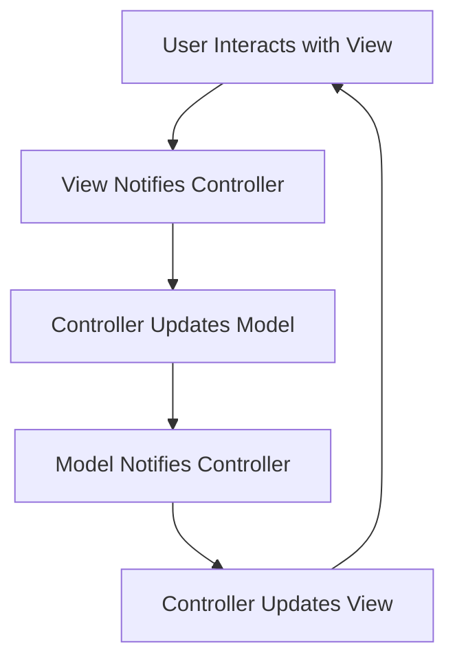

# Messenger Clone Android View

A Flutter application implementing a messenger clone with MVC architecture.

## Architecture

This project follows the **MVC (Model-View-Controller)** pattern to organize code for maintainability and scalability.

### MVC Components

- **Model**: Handles data and business logic.

  - `User`: Represents user data.
  - `Message`: Represents message data.

- **View**: UI components and screens.

  - `ChatsScreen`: Displays chat list and interactions.
  - `MenuScreen`: Main menu interface.
  - `NotificationsScreen`: Notifications view.
  - `StoriesScreen`: Stories feature.
  - `BottomNavigationBarWidget`: Custom navigation bar.
  - `CustomSwitchWidget`: Reusable switch component.

- **Controller**: Manages state and logic using Provider for state management.
  - `ChatController`: Manages chat messages and interactions.

### Folder Structure

```
lib/
├── main.dart
├── app.dart
├── models/
│   ├── user.dart
│   └── message.dart
├── views/
│   ├── screens/
│   │   ├── chats_screen.dart
│   │   ├── menu_screen.dart
│   │   ├── notifications_screen.dart
│   │   └── stories_screen.dart
│   └── widgets/
│       ├── bottom_navigation_bar_widget.dart
│       └── custom_switch_widget.dart
├── controllers/
│   └── chat_controller.dart
└── services/  # Directory reserved for future API integration services
```

### Workflow



## Features

- Chat list and messaging interface
- Menu navigation
- Notifications view
- Stories feature
- Custom UI widgets

## Getting Started

1. Ensure Flutter is installed.
2. Run `flutter pub get` to install dependencies.
3. Run `flutter run` to start the app on Android.

## Dependencies

This project uses the following key dependencies (from `pubspec.yaml`):

- Flutter SDK
- Provider (for state management)

## Future Enhancements

- User authentication (login/signup)
- Real-time messaging with backend API
- File sharing and group chats
- Improved UI/UX to match Messenger design
- Push notifications

## Contributing

1. Fork the repository.
2. Create a feature branch.
3. Commit changes.
4. Push and create a pull request.

## License

This project is licensed under the MIT License.
