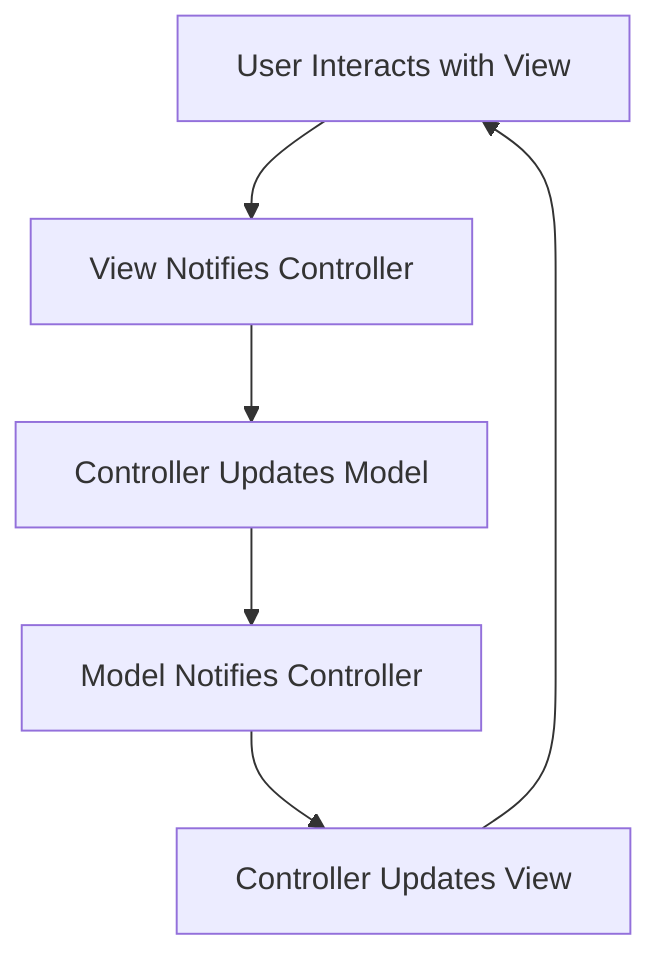

# Messenger Clone Android View

A Flutter application implementing a messenger clone with MVC architecture.

## Architecture

This project follows the **MVC (Model-View-Controller)** pattern to organize code for maintainability and scalability.

### MVC Components

- **Model**: Handles data and business logic.

  - `User`: Represents user data.
  - `Message`: Represents message data.

- **View**: UI components and screens.

  - `LoginScreen`: User authentication.
  - `ChatListScreen`: List of chats.
  - `ChatScreen`: Individual chat interface.
  - `ProfileScreen`: User profile display.
  - `MessageBubble`: Reusable message widget.

- **Controller**: Manages state and logic using Provider for state management.
  - `AuthController`: Handles login, signup, and user session.
  - `ChatController`: Manages chat messages and interactions.

### Folder Structure

```
lib/
├── main.dart
├── models/
│   ├── user.dart
│   └── message.dart
├── views/
│   ├── screens/
│   │   ├── login_screen.dart
│   │   ├── chat_list_screen.dart
│   │   ├── chat_screen.dart
│   │   └── profile_screen.dart
│   └── widgets/
│       └── message_bubble.dart
├── controllers/
│   ├── auth_controller.dart
│   └── chat_controller.dart
└── services/
    └── api_service.dart  # (Future: For API calls)
```

### Workflow



## Features

- User authentication (login/signup)
- Chat list
- Real-time messaging (basic implementation)
- User profiles

## Getting Started

1. Ensure Flutter is installed.
2. Run `flutter pub get` to install dependencies.
3. Run `flutter run` to start the app.

## Future Enhancements

- Integrate with backend API for real-time messaging.
- Add file sharing, group chats, etc.
- Improve UI/UX to match Messenger design.
